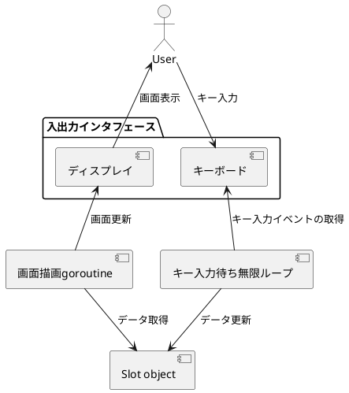

ファイルパーミッションでスロットがしたい
===

この記事は[2021年Goアドベントカレンダー](https://qiita.com/advent-calendar/2021/go)1日目の記事です。

ファイルパーミッションでスロットするコマンドラインツールを作りました。

# 経緯

ある日、サーバ上のとあるファイルの実行権限を変更する事がありました。

```bash
$ ls -lah sample_cmd
-rwxr--r-- 1 jiro4989 jiro4989 0 Nov 21 15:14 sample_cmd*

$ chmod 0777 ./sample_cmd

$ ls -lah sample_cmd
-rwxrwxrwx 1 jiro4989 jiro4989 0 Nov 21 15:14 sample_cmd*
```

この `chmod 0777`って数字が3つ並んでるからパチスロみたいだなーーーと唐突に思いました。
（パチスロやったことないですが）

じゃあ、「ファイルのパーミッションをスロットで設定できたらテンション上がって地
味なサーバオペレーションが華やいでハッピーになるのでは？」と思い至りました。

思い立ったが吉日ということで作りました。

# 成果物

[slotchmod](https://github.com/jiro4989/slotchmod)というコマンドを作りました。


まさにスロットですね。Enterキーを押すと回転してるスロットが停止します。

ファイルパーミッションを変更するという地味な作業が、
ドキドキハラハラなゲームに早変わりしました。

# 実装

画面UIの描画には[termbox-go](https://github.com/nsf/termbox-go)を使用しました。

処理としては、「画面描画用のgoroutine」と「キー入力待ちの無限ループ」という
2つの処理が並列に動作して機能を実現しています。

以下はデータ更新と取得の関係性を表したUML図です。PlantUMLで書きました。



goroutineを起動している処理は部分の処理の抜粋は以下です。

まずSlot object(以降Slot)を初期化し、termboxの初期化処理を行います。
次に画面描画goroutineを起動し、キー入力待ちの無限ループに入ります。

```main.go
// 省略

func main() {
    args, err := ParseArgs()
    if err != nil {
        Err(err)
        os.Exit(1)
    }

    interval := slotIntervalTime[args.Level]
    style := styles[args.Style]
    slot := NewSlot(0, interval)

    if err := termbox.Init(); err != nil {
        panic(err)
    }
    defer termbox.Close()
    termbox.SetInputMode(termbox.InputEsc)
    termbox.Flush()

    go clock(slot, style)
    waitKeyInput(slot)
    termbox.Close()

    changeMode(slot, args.Args)
}

func clock(s *Slot, st DrawStyle) {
    for !s.IsFinished() {
        s.Switch()
        DrawSlot(s, st)
        time.Sleep(time.Duration(s.IntervalTime()) * time.Millisecond)
    }
}

func waitKeyInput(s *Slot) {
    for {
        switch ev := termbox.PollEvent(); ev.Type {
        case termbox.EventKey:
            switch ev.Key {
            case termbox.KeyCtrlC, termbox.KeyCtrlD:
                return
            case termbox.KeyEnter:
                s.Select()
            }
            switch ev.Ch {
            case 'q':
                return
            }
        }
        if s.IsFinished() {
            return
        }
    }
}
```

Slotのフィールドと関数は以下のようになっています。

現在選択中のスロットを`currentSlotIndex`というフィールドで管理しています。
`currentSlotIndex`はキー入力のEnterで1ずつインクリメントされ、値が2を超えるとSlotは終了状態に変化します。
Slotが終了状態になると、キー入力待ち無限ループもループを脱出し、Slotの結果を踏まえてファイルパーミッションを更新します。

```slot.go
const (
    slotMinValue = 0
    slotMaxValue = 7
)

type Slot struct {
    slots            [3]int
    currentSlotIndex int
    isFinished       bool
    intervalTime     int
}

func NewSlot(seed int64, interval int) *Slot {
    if seed == 0 {
        i, _ := crand.Int(crand.Reader, big.NewInt(math.MaxInt64))
        seed = i.Int64()
    }
    rand.Seed(seed)

    s := Slot{}
    for i := 0; i < 3; i++ {
        slotValue := rand.Intn(slotMaxValue + 1)
        s.slots[i] = slotValue
    }
    s.intervalTime = interval

    return &s
}

func (s *Slot) Switch() {
    s.slots[s.currentSlotIndex] = s.NextValue()
}

func (s *Slot) Select() {
    if 2 <= s.currentSlotIndex {
        s.isFinished = true
        return
    }
    s.currentSlotIndex++
}

func (s *Slot) IsFinished() bool {
    return s.isFinished
}

func (s *Slot) Slots() [3]int {
    return s.slots
}

func (s *Slot) PreviousValue() int {
    v := s.slots[s.currentSlotIndex] - 1
    if v < slotMinValue {
        v = slotMaxValue
    }
    return v
}

func (s *Slot) CurrentValue() int {
    return s.slots[s.currentSlotIndex]
}

func (s *Slot) CurrentSlotIndex() int {
    return s.currentSlotIndex
}

func (s *Slot) NextValue() int {
    v := s.slots[s.currentSlotIndex] + 1
    if slotMaxValue < v {
        v = slotMinValue
    }
    return v
}

func (s *Slot) IntervalTime() int {
    return s.intervalTime
}
```

画面描画goroutineが呼び出している処理はこんな感じです。
愚直に文字列を組み立てているだけで、特筆することはありません。

```view.go
// 省略

func DrawSlot(s *Slot, st DrawStyle) {
    termbox.Clear(termbox.ColorDefault, termbox.ColorDefault)

    idx := s.CurrentSlotIndex()
    pv := s.PreviousValue()
    nv := s.NextValue()
    slots := s.Slots()

    switch st {
    case DrawStyleSimple:
        drawSimple(slots, idx, pv, nv)
    case DrawStyleBig:
        drawBig(slots, idx, pv, nv)
    default:
        drawSimple(slots, idx, pv, nv)
    }

    termbox.Flush()
}

func drawSimple(slots [3]int, idx, pv, nv int) {
    p := [3]string{" ", " ", " "}
    p[idx] = fmt.Sprintf("%d", pv)

    n := [3]string{" ", " ", " "}
    n[idx] = fmt.Sprintf("%d", nv)

    rows := []string{
        fmt.Sprintf("      %s %s %s", p[0], p[1], p[2]),
        fmt.Sprintf("chmod %d %d %d", slots[0], slots[1], slots[2]),
        fmt.Sprintf("      %s %s %s", n[0], n[1], n[2]),
    }

    for y, row := range rows {
        for x, r := range row {
            termbox.SetChar(x, y, r)
        }
    }
}
```

# ハッピーになれる機能

3つ揃うと「BINGO🎉」と出してくれます。


集中しっぱなしで神経を使う本番作業にささやかなお祝いメッセージをお届けしてくれます。
これでハッピー。

それが作業者の意図したパーミッションなのかどうかはslotchmodの関心事ではありません。

# まとめ

以下の内容を書きました。

- ファイルパーミッションでスロットするコマンドラインツールを作りました
  - ライブラリには termbox-go を使用しています
  - 画面描画とキー入力待ちの2つの処理を並列で動かして機能を実現しています
  - 数字が3つ揃うと「BINGO🎉」と出してくれます
- 自己責任で使いましょう

以上です。
